# Distributed Log Processing with AI Agent

## 📖 Overview

This project is a **Distributed Log Processing System** built with **Node.js (TypeScript)**, **AWS**, and **AI Agent (Claude)**.  
It is designed to handle large volumes of log data in **real time**, detect anomalies using AI, and store insights in a **scalable distributed architecture**.

### 🎯 Key Features

- **Log Ingestion Service** → Accepts logs from distributed clients.
- **Queue Processing** → Uses **AWS SQS** for scalable log streaming.
- **AI Anomaly Detection** → Sends logs to **Claude API** for anomaly detection.
- **Storage & Metadata** → Stores processed log metadata in **DynamoDB**.
- **Distributed Workers** → Multiple worker nodes can consume logs concurrently.
- **Alerts** → Sends **SNS email alerts** for critical logs.
- **Dashboard-ready** → Exposes APIs for monitoring & future integration with Grafana/React dashboards.

---

## 🏗 Architecture

```mermaid
flowchart TD
    A["Log Source: Apps/Servers"] -->|Send logs| B["Log Ingestion API (Express & TypeScript)"]
    B -->|Push| C["SQS Queue"]
    C --> D["Worker Service (Node.js Consumers)"]
    D -->|Metadata| E["DynamoDB"]
    D -->|Send log snippet| F["Claude AI API"]
    F -->|Anomaly Detection| D
    D -->|Critical Alert| G["SNS Topic → Email Alerts"]
    D --> H["Monitoring / API Layer"]
    H --> I["Dashboard / Grafana / React Frontend"]
```



---

## ⚙️ Tech Stack

- **Backend Runtime** → Node.js + TypeScript
- **Queue** → AWS SQS
- **Storage** → DynamoDB (metadata & analyzed logs)
- **AI Integration** → Claude (Anthropic API) for anomaly detection
- **Alerts** → AWS SNS for critical logs
- **Config & Secrets** → dotenv + `.env`
- **Monitoring Ready** → Exposes REST APIs for dashboards

---

## 🚀 Setup & Run

### 1️⃣ Clone Repo

```bash
git clone https://github.com/ridhamz/distributed-log-ai.git
cd distributed-log-ai
```

### 2️⃣ Install Dependencies

```bash
npm install
```

### 3️⃣ Configure Environment

Create a `.env` file in root:

```env
AWS_REGION=us-east-1
SQS_QUEUE_URL=https://sqs.us-east-1.amazonaws.com/123456789012/log-queue
DYNAMO_TABLE=ProcessedLogs
SNS_TOPIC_ARN=arn:aws:sns:us-east-1:123456789012:CriticalLogAlerts
CLAUDE_API_KEY=your-claude-api-key
CLAUDE_MODEL=claude-3-opus-20240229
PORT=4000
```

### 4️⃣ Run in Dev Mode

```bash
npm run dev
```

### 5️⃣ Run in Prod Mode (compiled)

```bash
npm run build
npm start
```

---

## 🔌 AWS + AI Integration

- **Logs ingestion** → API receives logs and pushes them to **SQS queue**.
- **Workers** → Consume messages from SQS and insert metadata / processed logs into **DynamoDB**.
- **AI (Claude)** → Selected logs are passed to **Claude** for anomaly detection.
- **Alerts** → Critical logs trigger **SNS email notifications**.
- **Insights** → Results are stored in DynamoDB and exposed via REST APIs.

---

## 📊 Future Improvements

- Add **Grafana dashboard** for real-time visualization.
- Support **multi-region replication** for HA.
- Introduce **stream-based training** for AI models (self-learning).
